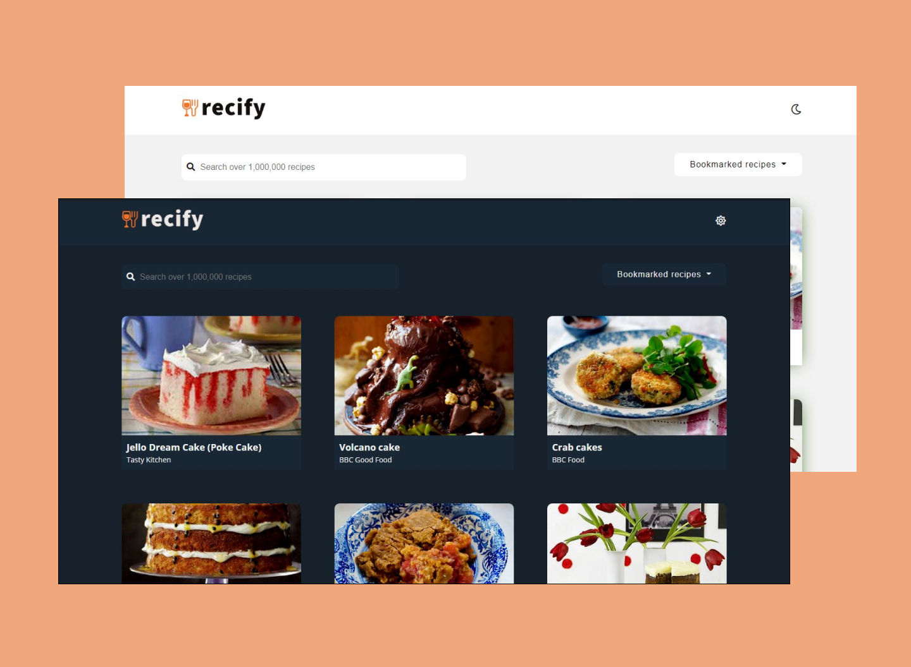

# Recify
A Web Application to help you find any recipe among **1,000,000** recipes 
 

## Features
- Get all the recipes corresponding to your search query
- A detailed section for each recipe
- Bookmark and Save any recipe along with **controlling** the amount of ingredients as per the number of servings
- Use it in both light and dark mode
- More info option in case the data is insufficient 
- Use it on any device/screen-width

 

## Languages, Techniques and Tools Used
- HTML5, Sass(SCSS syntax), Vanilla JavaScript 
- ES6 Modules
- MVC Architecture
- Parcel
- Babel
- Fluid Typography
- fontAwesome
- Google Fonts
- Adobe Spark
- Vs Code 

## Things I Learned
- How we can use the ES6 modules along with MVC Architecture to make our code clean and manageable
- Using Babel to compile the ES6 syntax to ES5 and also Polyfilling new features like Async-Await
- Using zero-configuration bundler **parcel** 
- In-build *fetch* function to make GET and POST request 

## Resources 
- [Fluid Typography](https://css-tricks.com/snippets/css/fluid-typography/) to make your web site/app even more responsive
- Use [Sass module system](https://www.youtube.com/watch?v=CR-a8upNjJ0) and avoid using **@import**
- In case of converting decimals to fractions, use [fracty package](https://www.npmjs.com/package/fracty)
- This [parcel tutorial](https://www.youtube.com/watch?v=8rD9amRSOQY) is pretty good for a beginner
